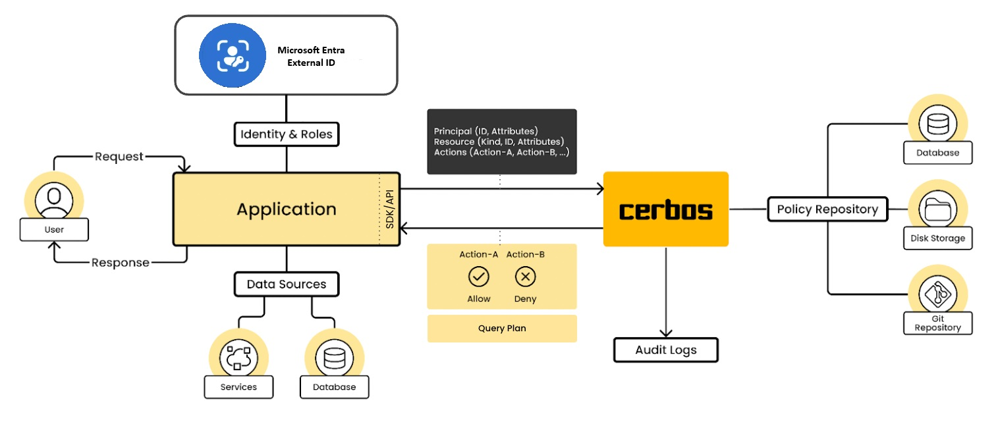

# Node.js & Express Web App with Microsoft Entra External ID and Cerbos

This sample demonstrates a Node.js & Express web app that lets users authenticate with [Microsoft Entra External ID](https://learn.microsoft.com/en-us/entra/external-id/external-identities-overview) and authorize actions with [Cerbos](https://cerbos.dev/).

## Overview


The web application in this project allows users to view, create, edit, and delete posts. The authorization logic is defined in Cerbos policies, which specify who can perform which actions on which resources. For example, only the author of a post can edit or delete it. 

The web application also uses Microsoft Entra External ID to authenticate users and obtain their identity information, such as name, roles, etc. The web application is based on the [A Node.js & Express web app authenticating users against Azure AD for Customers with MSAL Node](https://github.com/Azure-Samples/ms-identity-ciam-javascript-tutorial/tree/main/1-Authentication/5-sign-in-express) tutorial.

## Prerequisites

- [Node.js](https://nodejs.org).

- [Visual Studio Code](https://code.visualstudio.com/download) or another code editor.
- Docker for running the [Cerbos Policy Decision Point (PDP)](https://docs.cerbos.dev/cerbos/0.6.0/installation/container.html)
- External ID for customers tenant. If you don't already have one, <a href="https://aka.ms/ciam-free-trial?wt.mc_id=ciamcustomertenantfreetrial_linkclick_content_cnl" target="_blank">sign up for a free trial</a> or [create a tenant with customer configurations in the Microsoft Entra admin center](https://learn.microsoft.com/en-us/entra/external-id/customers/quickstart-tenant-setup).
- [PowerShell](https://learn.microsoft.com/en-us/powershell/scripting/install/installing-powershell) (optional) -  this guid also provides alternative step-by-step instructions to complete the Microsoft Entra configuration. 

## Microsoft Entra Configuration

To enable your application to sign in users with Microsoft Entra, Microsoft Entra ID for customers must be made aware of the application you create. The app registration establishes a trust relationship between the app and Microsoft Entra. When you register an application, External ID generates a unique identifier known as an Application (client) ID, a value used to identify your app when creating authentication requests.

In this sample we offer two options to create this configuration, by using PowerShell script or following the step by step guid using the Entra portal. 

**Option A - PowerShell script**

1. Run the script to create your Azure AD application and configure the code of the sample application accordingly.

   ```PowerShell
   cd .\AppCreationScripts\
   .\Configure.ps1 -TenantId "your test tenant's id" -AzureEnvironmentName "[Optional] - Azure environment, defaults to 'Global'"
   ```

Find more information about the script [here](./AppCreationScripts/AppCreationScripts.md).

- After running the script don't forget to follow the instructions from the script output. You wll have to [create user flows](https://learn.microsoft.com/en-us/entra/external-id/customers/how-to-user-flow-sign-up-sign-in-customers) to allow users to sign up in the [application](https://learn.microsoft.com/en-us/entra/external-id/customers/how-to-user-flow-add-application).

**Option B - Step-by-step UI guide**

The full guide can be found [here](./EntraStepByStepGuide.md).

## Start Cerbos

1. Start up the Cerbos PDP instance docker container. This will be called by the express app to check authorization.

```bash
cd Cerbos
./start.sh
```

## Cofigure the Express APP

### Install project dependencies

1. Open a console window, and change to the directory that contains the Node.js sample app:

    ```console
        cd App
    ```

1. Run the following commands to install app dependencies:

    ```console
        npm install
    ```
### Configure the sample web app

1. In your code editor, open *App\authConfig.js* file.

1. Find the placeholder:

    1. `Enter_the_Application_Id_Here` and replace it with the Application (client) ID of the app you registered earlier.

    1. `Enter_the_Tenant_Subdomain_Here` and replace it with the Directory (tenant) subdomain. For example, if your tenant primary domain is `contoso.onmicrosoft.com`, use `contoso`. If you don't have your tenant name, learn how to [read your tenant details](how-to-create-customer-tenant-portal.md#get-the-customer-tenant-details).

    1. `Enter_the_Client_Secret_Here` and replace it with the app secret value you copied earlier.

### Run and test sample web app

You can now test the sample Node.js web app. You need to start the Node.js server and access it through your browser at `http://localhost:3000`.

1. In your terminal, run the following command:

    ```console
        npm start 
    ```

1. Open your browser, then go to `http://localhost:3000`. You should see the page similar to the following screenshot:

2. After the page completes loading, select **Sign in** link. You're prompted to sign in.

3. On the sign-in page, type your **Email address**, select **Next**, type your **Password**, then select **Sign in**. If you don't have an account, select **No account? Create one** link, which starts the sign-up flow.

4. If you choose the sign-up option, after filling in your email, one-time passcode, new password and more account details, you complete the whole sign-up flow. You see a page similar to the following screenshot. You see a similar page if you choose the sign-in option.

5. Select **Sign out** to sign the user out of the web app or select **View ID token claims** to view ID token claims returned by Microsoft Entra.

## Assign Admin role

Navigate to Enerpirse apps 
Find the user
Edit Assignment


## How it works
